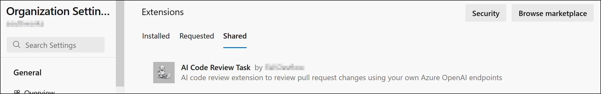
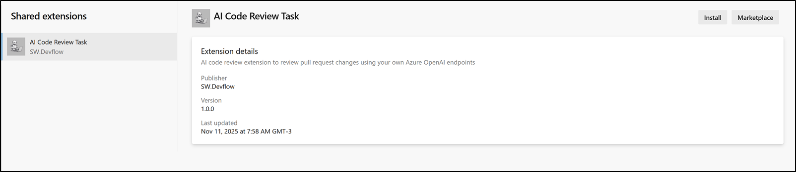
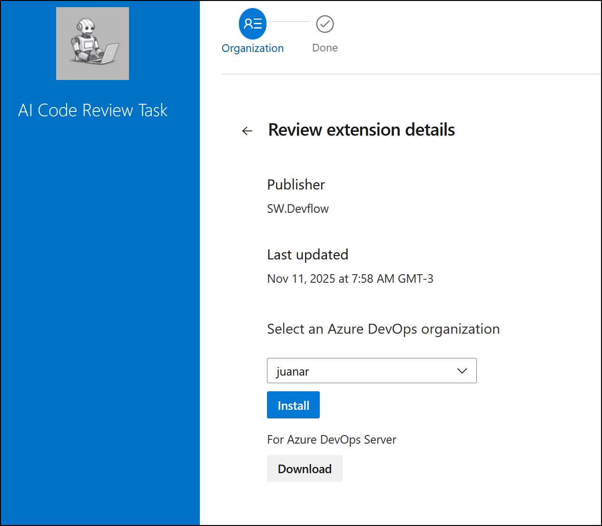
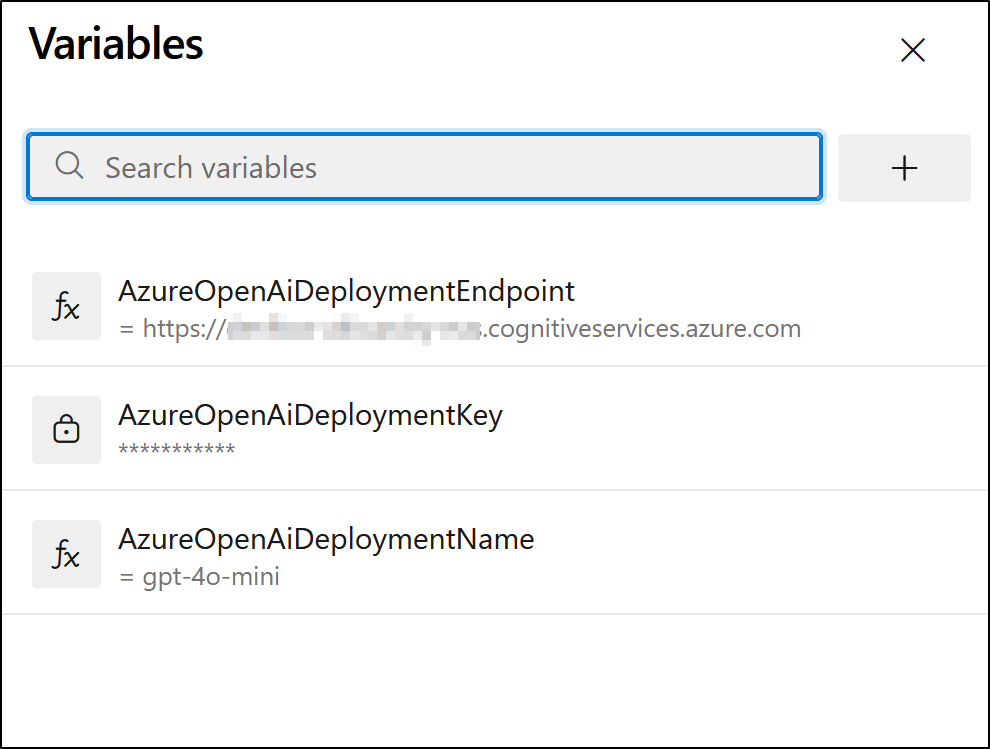
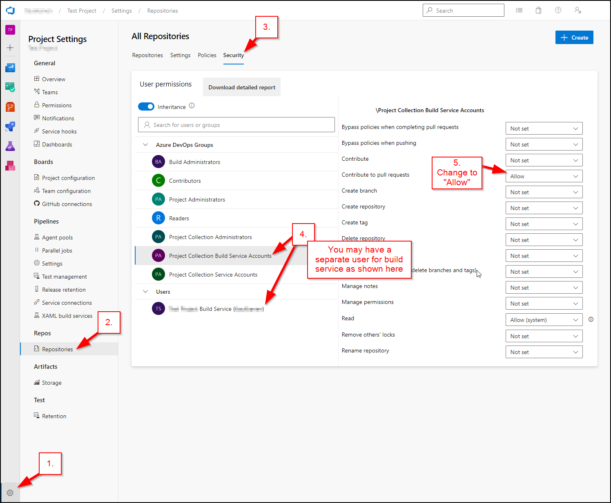
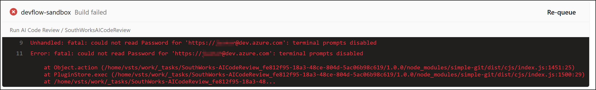

# AI Code Review DevOps Extension

## Setup the Devops extension

### Create publisher

If you don't have a Visual Studio Marketplace publisher yet, follow this guide to [Create a Publisher](https://learn.microsoft.com/en-us/azure/devops/extend/publish/overview?view=azure-devops#create-a-publisher)

### Update task.json

Next, edit the `ai-code-review/task.json` file.

The task id must be unique. Generate one using PowerShell: `(New-Guid).Guid`

You can also change the task display name and adjust its version.

To learn more about the `task.json` format see the official [documentation](https://learn.microsoft.com/en-us/azure/devops/extend/develop/add-build-task?view=azure-devops#understanding-taskjson-components)

### Install packaging tools

Install the Cross Platform Command Line Interface (tfx-cli):

```
npm install -g tfx-cli
```

### Update vss-extension.json

Update the `vss-extension.json` file located in the repository root.

The `publisher` property must match your publisher id.

<table><tbody><tr><td>Property</td><td>Description</td></tr><tr><td><code>publisher</code></td><td>Your marketplace publisher identifier</td></tr><tr><td><code>contributions.id</code></td><td>Unique identifier within the extension</td></tr><tr><td><code>version</code></td><td>Must match the task version</td></tr></tbody></table>

### Build the package

#### Build the internal project

```
cd ai-code-review
npm i
npm run build
```

#### Build the extension package

```
# Go back to root with cd .. if necesary
npm i
npx tfx-cli extension create
```

## Publish the extension

Once you have the `.vsix` package, you can follow the guides to [Publish](https://learn.microsoft.com/en-us/azure/devops/extend/publish/overview?view=azure-devops#publish-your-extension) and [Share](https://learn.microsoft.com/en-us/azure/devops/extend/publish/overview?view=azure-devops#share-your-extension) the extension.

   
## Install the extension

To use the extension in a pipeline you must install it from the organization settings.
Change the org name in the link: https://dev.azure.com/{ORG_NAME}/_settings/extensions?tab=shared

1. Select Shared Extensions
    
2. Click Install
    
3. Select the org and install the extension
    

Note: You need the Project Collection Administrator role to see the install options.

## Use the extension in your pipeline

### Prerequisites

#### Azure resources

*   [Azure DevOps Account](https://dev.azure.com/)
*   Azure OpenAI endpoint URI
*   Azure OpenAI endpoint key
*   Azure OpenAI deployment name

#### Pipeline settings

1. Create a basic `azure-pipeline.yaml` and [configure build validation](https://learn.microsoft.com/en-us/azure/devops/repos/git/branch-policies?view=azure-devops&tabs=browser#build-validation)
2. Add the task to your `azure-pipeline.yaml` file. Example:
```
  trigger:
    branches:
      include:
        - master
        - '*'

  pr:
    branches:
      include:
        - '*'

  pool:
    vmImage: 'ubuntu-latest'

  jobs:
  - job: CodeReview
    displayName: 'Run AI Code Review'
    pool:
      vmImage: 'ubuntu-latest'
    steps:
    - checkout: self
      persistCredentials: true
    - task: SouthWorks-AICodeReview@1.0.4
      inputs:
        azureOpenAiDeploymentEndpointUrl: $(AzureOpenAiDeploymentEndpoint)
        azureOpenAiApiKey: $(AzureOpenAiDeploymentKey)
        azureOpenAiDeploymentName: $(AzureOpenAiDeploymentName)
        azureOpenAiApiVersion: '2024-04-01-preview'
        promptTokensPricePerMillionTokens: '0.15'
        completionTokensPricePerMillionTokens: '0.6'
        addCostToComments: true
        reviewBugs: true
        reviewPerformance: true
        reviewBestPractices: true
        reviewWholeDiffAtOnce: true
        maxTokens: 16384
        fileExtensions: '.js,.ts,.css,.html,.tf'
        fileExcludes: ''
        additionalPrompts: |
          Fix variable naming, Ensure consistent indentation, Review error handling approach, Check for OWASP best practices
```
Change the task name and version to match yours.

3. Add the pipeline variables `AzureOpenAiDeploymentEndpoint`, `AzureOpenAiDeploymentKey` and `AzureOpenAiDeploymentName`.
    
4. Grant permission to allow comments on PRs
    

Note: the `persistCredentials` step is required to make the OAuth token available to the task:
```
- checkout: self
  persistCredentials: true
```
  


## License

This project is licensed under the [MIT License](LICENSE).

Project was originally forked from [a1dancole/OpenAI-Code-Review](https://github.com/a1dancole/OpenAI-Code-Review).